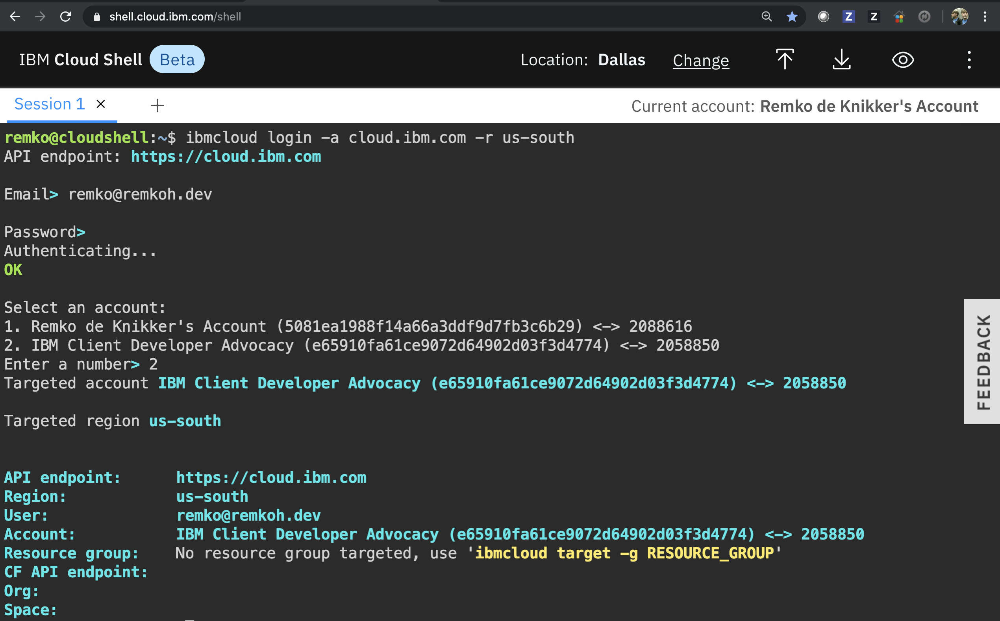

# Setup
Please login to IBM Cloud
Create Standard kubernetes cluster.
Please reffer to this page for detailed information. https://cloud.ibm.com/docs/containers?topic=containers-cs_ov#cluster_types
In this lab, you can use single zone, 2 vCPU 4GB, 1 worker node(pool)

I recommended using the IBM Cloud shell with tools pre-installed to run the labs at https://shell.cloud.ibm.com.

1. From the Cloud shell, clone the guestbook application,

    ```
    $ git clone https://github.com/remkohdev/helloworld.git
    $ ls -al
    ```

2. Log in to your cluster, e.g. if created in the `us-south` region,
(If you are using IBM CLoud shell, you don't have to login)

    ```
    $ ibmcloud login -a cloud.ibm.com -r us-south
    ```

3. If you are using federated SSO login, use the `-sso` flag instead.
4. Select the account in which the cluster was created.



1. Download the cluster configuration to the client

    ```
    $ CLUSTER_NAME=<clustername>
    $ ibmcloud ks cluster config --cluster $CLUSTER_NAME
    $ kubectl config current-context
    ```
